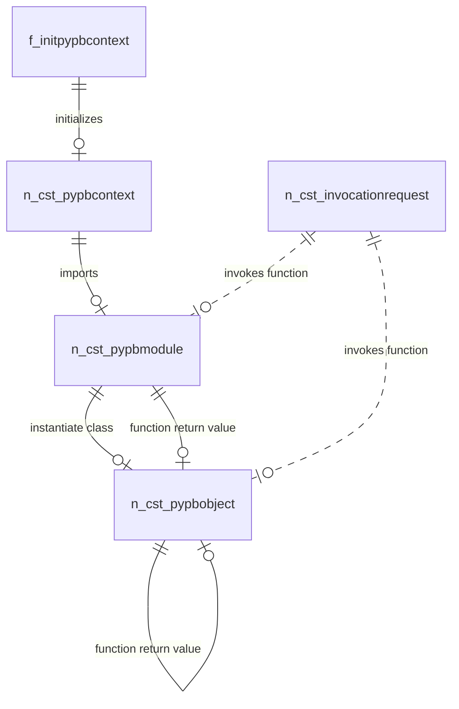

# PyPbLib introduction

This documents provides more technical information about the PyPb library (PyPbLib).

## Overview

This library offers a way for PowerBuilder applications to use Python code through a clear, concise and versatile interface. It does this by providing an abstraction layer over Python.NET that makes working with it from PowerBuilder easier and more familiar. It has both a .NET and PB interface, the latter of which is a wrapper to the former, allowing the developer to not have to guess or remember the methods, but instead make use of the PB IDE code assist.

### Module assemblies

PyPbLib contains three separate modules with their dependencies in their own folder to promote modularity. The following table establishes the folders containing the assembly dependencies for each PBL:

| PowerBuilder Library | Dependencies folder      | Function                                                     |
| -------------------- | ------------------------ | ------------------------------------------------------------ |
| pypblib              | bin.pypb.appeon          | Core library for PyPbLib                                     |
| pythoninspector      | bin.pypbinspector.appeon | Library for inspecting Python objects, functions and function signatures |
| pypbutils            | bin.pypbutils.appeon     | Library for obtaining information regarding Python runtimes in the system |

### Component interaction

The following diagram illustrates how the different components relate to each other:



The general library utilization flow is as follows:

1. Create a PyPbContext instance with a Python Runtime DLL. This can be done easily with the `f_initpypbcontext` function.
2. Import a module with `of_import` (equivalent to doing the same in a python script), or with `of_loadmodule` to load a module from a *.py*, *.pyc*, or a directory.
3. Call the module's functions with `n_cst_pypbmodule.of_invoke`, or instantiate a class in the module with `n_cst_pypbmodule.of_instantiate`.
4. With an `n_cst_pypbobject` in hand, access its properties through `of_get`/`of_set`, invoke its methods with`of_invoke`, or attempt to convert the object into a native type with the `of_to...` sets of functions.

## PyPb.Pb

PowerBuilder objects and accompanying files that wrap the core PyPb.Net classes on NVOs, exposing the .NET methods as equivalent PB methods for clarity and improved debuggability.

One difference between the PB methods and their C# equivalent, is that in C#, each function has an out parameter through which errors are returned. However, in PowerBuilder, in order to offer a more familiar interface to PowerBuilder developers, this is instead converted into an error-containing structure (`str_pypbobject`) in each of the objects. After performing a call, the `istr_error` member is filled with the error details which can be accessed in response to a negative status code.

For example:

In C#:

```csharp
public int Invoke(InvocationRequest request, out PyPbObject? result, out string? error)
{...}
```

In PowerBuilder:

```csharp
public function long of_invoke (readonly n_cst_invocationrequest anv_req, ref n_cst_pypbobject anv_result)
```

Note the missing `error` parameter. The error is parsed automatically and stored in the object's `str_pypberror` member. See [Error Handling](#error-handling) for more details. 

### Objects

#### n_cst_pypbcontext

Abstraction of a Python runtime through which `n_cst_pypbmodule` instances are obtained and Python statements executed. It must only be obtained through `n_cst_pypbcontextwrapper` or `f_pypbcontextinit` (recommended).

#### n_cst_pypbmodule

Abstraction of a Python module, obtained from a `n_cst_pypbcontext`. It can instantiate objects, invoke functions or obtain members.

#### n_cst_pypbobject

Abstraction of a Python object. It can only be obtained from an `n_cst_pypbmodule` or another `n_cst_pypbobject`. It can invoke methods, get/set properties, obtain members, be invoked (in the case of callable objects such as functions, lambdas, etc), accessed by string or integer index; it also has functions to try to convert the object into many PB datatypes such as `of_toInt()`, `of_toBoolean()`, `toDouble()`, etc.

#### n_cst_invocationrequest

Object container used to configure a more complex request for invocation/instantiation functions (e.g. `n_cst_pypbmodule.of_instantiate(...)` , `n_cst_pypbobject.of_invoke(...)`, among others). It also supports named arguments and Keyword Arguments (kwargs).

This same object can also be used to configure the locals for a `of_executestatement` operation with the `of_addnamedargument(...)` function.

#### n_cst_pythoninspector

Tool that introspects Python objects, modules and functions; returning their members and, for the functions, their signatures and parameters.

### How to use

#### Data type mapping

Type handling in Python is very different to that of PowerBuilder. Among other things, in Python, there is no strict type enforcing. Instead, it follows a [duck typing strategy](https://en.wikipedia.org/wiki/Duck_typing): an object is of a given type if it has all methods and properties required by that type. This makes it necessary to enforce a strict type conversion when working with Python objects because PowerBuilder uses static typing. The following table shows the types explicitly allowed to be converted from Python to PowerBuilder, as well as the corresponding type for the intermediary C# layer.

| PowerBuilder Type | C# Type | Python type              |
| ----------------- | ------- | ------------------------ |
| string            | string  | string                   |
| long              | Int32   | int                      |
| double            | double  | float (double precision) |
| boolean           | bool    | bool                     |

> Note: Python's `float` type is double precision in CPython

This table only shows the types that can be converted from Python to PowerBuilder native variables; there is no limitation on the types of Python objects that can be held on an `n_cst_pypbobject` instance. Any Python object can be held on an `n_cst_pypbobject`, and thus, passed to Python function calls (with `of_invoke`, `of_instantiate`) or set as Python object properties (with `of_set`, `of_setAtIndex`, `of_setAtKey`).

##### Conversion functions

`n_cst_pypbobject` has a set of functions to perform the conversion from Python to PowerBuilder types. Because Python objects aren't explicitly typed, whether or not an object can be converted to any specific type is not know until runtime, thus it's expected to get errors when attempting to convert an object to a PowerBuilder type.

The conversion functions provided have two variants:

- Throwing: If the conversion fails, an `n_cst_pypbruntimeerror` will be thrown
- Non-throwing: If the conversion fails, the function returns -1, and the object's [error state](#error-handling) is updated

| PB Type | Throws                       | Doesn't throw                        |
| ------- | ---------------------------- | ------------------------------------ |
| string  | of_tostring() returns string | of_tostring(Ref string) returns int  |
| long    | of_toint() returns long      | of_toint(Ref long) returns int       |
| double  | of_todouble() returns double | of_todouble(Ref double) returns int  |
| boolean | of_tobool() retunts boolean  | of_tostring(Ref boolean) returns int |

#### Importing the files

The files you will need to bring into your workspace depends on the features you want to use. Please refer to the following table:

| Feature         | Required files                                               |
| --------------- | ------------------------------------------------------------ |
| PyPb (Core)     | `pypblib.pbl`, `bin.pypb.appeon\*`                           |
| PythonInspector | `pythoninspector.pbl`, `bin.pypbinspector.appeon\*`, `pypblib.pbl, bin.pypb.appeon\*` |
| PyPbUtils       | `pypbutils.pbl`, `bin.pypbutils.appeon\*`                    |

The objects in the PBLs expect the directories to be at workspace-level. If you wish to change this structure you will need to do the appropriate changes to the objects.

#### Initialize the Python Context

To be able to interact with any of the classes in the library, a valid `n_cst_pypbcontext` instance is required. This can be easily created with the `f_pypbcontextinit` function.

> Note: If an initialization attempt is unsuccessful, it's recommended to restart the process, as the attempts make changes to the Pythoh.NET engine's internal state that affect subsequent invocations. This is a limitation on Python.NET's side.

Once the PyPbContext has been initialized, further calls to the `f_pypbcontextinit` function return the same instance, and the string "reusing" in the `ls_error` parameter.

#### Load a Python Module

With the `n_cst_pypbcontext` acquired, you can load a Python module (**.py*, *\*.pyc*, directory) using `n_cst_pypbcontext.of_loadmodule`  or directly import a Python module from site-packages (e.g. `inspect`, `os`, etc.) with  `n_cst_pypbcontext.of_import`. Both functions return a  `n_cst_pypbmodule`.

#### Class instantiation and function invocation

`n_cst_pypbmodule` may contain functions or classes. These two entities are accessed in a similar manner.

##### Using direct invocation

If the method/class constructor takes no arguments (apart from the `self`  argument), the call can be done directly with the function name through `n_cst_pypbobject.of_invoke(string functionName, ref n_cst_pypbobject result, ref string error)` or `n_cst_pypbmodule.of_instantiate(string className, ref n_cst_pypbobject result, ref string error)`

##### Using InvocationRequest

`n_cst_invocationrequest` is an object that encapsulates an invocation request with arguments that can be used to instantiate a class or invoke a function. They can be created manually through the `n_cst_invocationrequestassembly.of_createondemand`, or with the `f_newinvocationrequest` function. `n_cst_pypbobject` and `n_cst_pypbmodule` also have convenience methods for creating one. The `target` parameter indicates either the name of the class to instantiate or the name of the method to invoke. Arguments can be configured by calling the InvocationRequest's `of_addargument(...)` overloaded function. These objects can be reused. You can also clear the arguments by calling `of_cleararguments`. However, the target cannot be changed, you need to create another instance.

Only  `n_cst_pypbmodule` can instantiate classes with `of_instantiate`, but both  `n_cst_pypbmodule` and  `n_cst_pypbobject` have a set of  `of_invoke` functions.

These functions take either the name of the target (for parameter-less invocation) or a `n_cst_invocationrequest` instance. Most functions in this library return an integer (0 on success, -1 on failure) and have a REF `n_cst_pypbobject` and REF `string` as last arguments for passing the result and error.

Note: This approach is the most reliable and flexible as it can conditionally configure parameters. This is also the only approach that allows calling Python functions that have default arguments without having to explicitly specify them.

Keyword arguments are supported only through `InvocationRequest` objects. They are added with `of_addnamedargument`.

- Using the proxy methods (through the idn_host member)

When a `n_cst_pypbobject` instance is returned from any `of_get`, `of_invoke` or `of_instantiate` method, or a `n_cst_pypbmodule` obtained from the context's `of_import` or `of_loadmodule`, the C# code creates a dynamic class that contains proxy functions with the same name and signature as they are defined on the the python object with two variants:

1. Method with two additional parameters: a `REF dotnetobject` and `REF string` for handling the method's return value and error. These proxy methods return an `integer` for error status (0 for success and -1 for error). These methods need to be accessed from the `n_cst_pypbobject|n_cst_pypbmodule`'s internal `idn_host` dotnetobject.
2. Method with no additional parameters: The generated method matches the signature of the Python function and returns the result normally. When using these functions, it's recommended to wrap the call inside a Try/Catch block to handle any errors coming from the Python runtime. These exceptions are thrown as `OLERuntimeError` instances.

For example, a method call configured using an invocation request that looks like this:

```python
lnv_request = lnv_stylingmodule.of_createinvocationrequest("createStyle")
lnv_request.of_addargument("header")
lnv_request.of_addargument(lstr_selectedTheme.s_headerfillcolor)
lnv_request.of_addargument(lstr_selectedTheme.s_headertextcolor)
res = lnv_stylingmodule.of_invoke(lnv_request, Ref lnv_headerStyle)
If res <> 0 Then
    as_error = "Could not create style: " + lnv_stylingmodule.of_lasterrormessage()
    Return -1
End If
```

can be written more succinctly like this:

```python
res = lnv_stylingmodule.idn_host.createStyle("header", lstr_selectedTheme.s_headerfillcolor, lstr_selectedtheme.s_headertextcolor, Ref ldn_aux,	Ref ls_error)
		
If res <> 0 Then
    as_error = "Could not create style: " + ls_error
    Return -1
End If
lnv_headerstyle = f_wrapobject(ldn_aux)
```

Or like this:

```````python
Try
	ldn_aux = lnv_stylingmodule.idn_host.createStyle("header", lstr_selectedTheme.s_headerfillcolor, lstr_selectedtheme.s_headertextcolor)
Catch(OLERuntimeError e)
	as_error = "Could not create style: " + e.Description
	Return -1
End Try
		
lnv_headerstyle = f_wrapobject(ldn_aux)
```````

Notice how the function passes back the call result as dotnetobject `ldn_aux`. We immediately wrap this object into an `n_cst_pypbobject` with the `f_wrapobject` function.

Considerations:

- This approach does not support calling functions defined with default parameters omitting said parameters. If calling one such function you need to explicitly pass all the arguments that the function defines.
- Python's `inspect` module is used to obtain the methods/classes and their invocation signatures. This approach might fail specially on some complex scenarios. In those cases, following the [InvocationRequest](#Using-InvocationRequest) approach is recommended.

##### Comparison of invocation techniques

The following table offers a comparison between the three techniques for accessing methods and instantiating classes:

| Direct invocation                      | Invocation Request                                           | Proxy methods                                                |
| -------------------------------------- | ------------------------------------------------------------ | ------------------------------------------------------------ |
| Most succinct                          | Can be very verbose                                          | Better than Invocation requests for lots of arguments        |
| Doesn't support arguments              | Supports optional arguments                                  | Doesn't support optional arguments. All arguments need to be explicitly stated |
| Called directly from the object/module | Needs to create a separate `n_cst_invocationrequest` object (can be created directly from the module/object) | Needs to be called on the idn_host member of the module/object |
| Returns `n_cst_pypbobject`             | Returns `n_cst_pypbobject`                                   | Returns `dotnetobject`, needs to be wrapped inside a `n_cst_pypbobject` manually or through the included function |

The library perfectly supports using any combination of these three techniques so you're free to use whichever is more appropriate for the situation.

#### Property access

To access a `n_cst_pypbobject`'s properties, use the `of_set`/`of_get` sets of functions. These functions also have arguments for passing in/out values and a `REF string` for the error.

#### Index Access

When the object is a list/tuple or any other integer-indexed container, its items can be accessed with `of_atIndex` and set with `of_setAtIndex`.

When the object is a dictionary or any other string-indexed container, items can be accessed with `of_atKey` and set with `of_setAtKey`.

#### Executing statements

`n_cst_pypbcontext`  has the `of_executestatement` function which can be used to pass statements to the Python runtime to execute directly. This can be used to perform complex operations on a single statement, or to create lists, tuples or dictionaries.

For example:

```python
lnv_object = context.of_executeStatement("(0, 1, 2)") ## results in a tuple containing 3 elements
```

Variables can be passed to the `of_executeStatements` through a `n_cst_invocationrequest` that configures the locals through the `of_addNamedArgument` function:

```python
n_cst_invocationrequest req
n_cst_pypbobject result
long ll_result
req = _module.of_createinvocationrequest("stub") ## when used for setting locals, the target name is irrelevant
req.of_addNamedArgument("x", 100)
req.of_addNamedArgument("y", 100)
result = _context.of_executeStatement("x * y", req)
ll_result = result.of_toInt()
```

#### Error Handling

##### Strategies

In order to provide a familiar interface to PowerBuilder developers, while at the same time offering modern approaches, PyPb offers two different error management strategies:

###### Status code + error structure

All PB-Python operations update an internal structure in the calling objects (`n_cst_pypbobject` / `n_cst_pypbmodule` / `n_cst_pypbcontext` / `n_cst_pythoninspector`).

The C# functions pass a JSON string through the `out string? error` which is automatically parsed by their PB equivalent with the `f_parseerror` function into the `istr_error` member of the corresponding object and can be accessed to obtain information about the error with the functions `of_lasterrormessage()`, `of_lasterrorstack()`, `of_lasterrortarget()` and `of_lasterrorarguments()`:

```python
res = inv_pandas.of_invoke(lnv_req, Ref lnv_dataframe)
If res <> 0 Then 
    MessageBox("Dataframe error", "Could not build dataframe: " + inv_context.of_lasterrormessage())
    SetNull(lnv_dataframe)
    Return lnv_dataframe
End If
```

The `str_pypberror` has the following members:

```
global type str_pypberror from structure
	string		s_stack // The stack trace from where the error originated
	string		s_message // A string describing the error
	string		s_pypbfunction // The object onto which the operation was attempted (if applicable)
	string		s_arguments // the arguments passed to the function (if applicable)
end type
```

###### Exception 

The same functions provide an alternative version that, instead of returning a status code and passing the result as a `Ref` variable, returns the value itself. E.g.:

```python
res = inv_pandas.of_invoke(lnv_req, Ref lnv_dataframe)
If res <> 0 Then 
    MessageBox("Dataframe error", "Could not build dataframe: " + inv_context.of_lasterrormessage())
    SetNull(lnv_dataframe)
    Return lnv_dataframe
End If
//////////////////////

Try
	lnv_dataframe = inv_pandas.of_invoke()
Catch (n_cst_pypbruntimeerror e)
	MessageBox("Dataframe error", "Could not build dataframe: " + e.GetMessage())
    SetNull(lnv_dataframe)
    Return lnv_dataframe
End Try
```

This approach can offer code savings when working with multiple functions consecutively, condensing all error checking into a single `Catch` block

Following are the functions that have throwing versions:

| Object            | Status code + error functions                                | Exception                                                    |
| ----------------- | ------------------------------------------------------------ | ------------------------------------------------------------ |
| n_cst_pypbcontext | of_executestatement(string, Ref n_cst_pypbobject) -> int     | of_executestatement(string) -> n_cst_pypbobject              |
|                   | of_executestatement(string, n_cst_invocationrequest, Ref n_cst_pypbobject) -> int | of_executestatement(string, n_cst_invocationrequest) -> n_cst_pypbobject |
|                   | of_fromimportmodule(string, string, Ref n_cst_pypbmodule) -> int | of_fromimportmodule(string, string) -> n_cst_pypbmodule      |
|                   | of_fromimportobject(string, string, Ref n_cst_pypbobject) -> int | of_fromimportobject(string, string) -> n_cst_pypbobject      |
| n_cst_pypbmodule  | of_get(string, Ref boolean) -> long                          | of_getBool(string) -> boolean                                |
|                   | of_get(string, Ref long) -> long                             | of_getLong(string) -> long                                   |
|                   | of_get(string, Ref n_cst_pypbobject) -> long                 | of_getObject(string) -> n_cst_pypbobject                     |
|                   | of_get(string, Ref string) -> long                           | of_getString(string) -> string                               |
|                   | of_getmember(string, Ref n_cst_pypbobject) -> int            | of_getmember(string) -> n_cst_pypbobject                     |
|                   | of_instantiate(n_cst_invocationrequest, Ref n_cst_pypbobject) -> long | of_instantiate(n_cst_invocationrequest) -> n_cst_pypbobject  |
|                   | of_instantiate(string, Ref n_cst_pypbobject) -> long         | of_instantiate(string) -> n_cst_pypbobject                   |
|                   | of_invoke(string, Ref n_cst_pypbobject) -> long              | of_invoke(string) -> n_cst_pypbobject                        |
|                   | of_invoke(n_cst_invocationrequest, Ref n_cst_pypbobject) -> long | of_invoke(n_cst_invocationrequest) -> n_cst_pypbobject       |
| n_cst_pypbobject  | of_atindex(long, Ref n_cst_pypbobject) -> long               | of_atindex(long) -> n_cst_pypbobject                         |
|                   | of_atkey(string, Ref n_cst_pypbobject) -> long               | of_atkey(string) -> n_cst_pypbobject                         |
|                   | of_call(Ref n_cst_pypbobject) -> int                         | of_call() -> n_cst_pypbobject                                |
|                   | of_get(string, Ref boolean) -> long                          | of_getBool(string) -> boolean                                |
|                   | of_get(string, Ref long) -> long                             | of_getLong(string) -> long                                   |
|                   | of_get(string, Ref n_cst_pypbobject) -> long                 | of_getObject(string) -> n_cst_pypbobject                     |
|                   | of_get(string, Ref string) -> long                           | of_getString(string) -> string                               |
|                   | of_getmember(string, Ref n_cst_pypbobject) -> int            | of_getmember(string) -> n_cst_pypbobject                     |
|                   | of_invoke(string, Ref n_cst_pypbobject) -> long              | of_invoke(string) -> n_cst_pypbobject                        |
|                   | of_invoke(n_cst_invocationrequest, Ref n_cst_pypbobject) -> long | of_invoke(n_cst_invocationrequest) -> n_cst_pypbobject       |
|                   | of_tobool(Ref boolean) -> int                                | of_toBool() -> boolean                                       |
|                   | of_toDouble(Ref double) -> int                               | of_toDouble() -> double                                      |
|                   | of_toInt(Ref long) -> int                                    | of_toInt() -> long                                           |
|                   | of_toString(Ref string) -> int                               | of_toString() -> string                                      |


### Example

This section will give an example of using PyPb to execute a sequence of Python operations, based on a public example that can be found on the homepage for [NumPy](https://numpy.org/) (as of the writing of this document). The original example is as follows:

```python
"""
To try the examples in the browser:
1. Type code in the input cell and press
   Shift + Enter to execute
2. Or copy paste the code, and click on
   the "Run" button in the toolbar
"""

# The standard way to import NumPy:
import numpy as np

# Create a 2-D array, set every second element in
# some rows and find max per row:

x = np.arange(15, dtype=np.int64).reshape(3, 5)
x[1:, ::2] = -99
x
# array([[  0,   1,   2,   3,   4],
#        [-99,   6, -99,   8, -99],
#        [-99,  11, -99,  13, -99]])

x.max(axis=1)
# array([ 4,  8, 13])

# Generate normally distributed random numbers:
rng = np.random.default_rng()
samples = rng.normal(size=2500)
samples

```

The equivalent code performed on PowerBuilder through PyPb can be found below.

```
n_cst_pypbcontext context
n_cst_pypbmodule np
n_cst_pypbobject dtype
n_cst_pypbobject _x
n_cst_pypbobject random
n_cst_pypbobject rng
n_cst_pypbobject samples
int res
string ls_error
n_cst_invocationrequest req

context = f_pypbcontextinit("C:\python_313_32\python313.dll", ref ls_error)
If Not IsNull(ls_error) Then
	MessageBox("Failed to initialize context", ls_error)
	Return
End If

Try
    res = context.of_import("numpy", ref np)
    If res <> 0 Then
        MessageBox("Failed to import module", context.of_lasterrormessage())
        Return
    End If

    dtype = np.of_getmember( "int64")

    req = np.of_createinvocationrequest("arange")
    req.of_addargument(15)
    req.of_addnamedargument("dtype", dtype)
    _x = np.of_invoke(req)

    req = np.of_createinvocationrequest("stub")
    req.of_addnamedargument("x", _x)
    context.of_executestatement("x[1:, ::2] = -99")

    req = _x.of_createinvocationrequest("reshape")
    req.of_addargument( 3)
    req.of_addargument( 5)
    _x = _x.of_invoke(req)

	MessageBox("x", _x.of_tostring( ))

    req = _x.of_createinvocationrequest("max")
    req.of_addnamedargument("axis", 1)
    _x = _x.of_invoke(req)
    MessageBox("x.max(axis=1)", _x.of_tostring( ))

    random = np.of_getmember("random")

    rng = random.of_invoke("default_rng")

    req = rng.of_createinvocationrequest("normal")
    req.of_addnamedargument("size", 2500)
    samples.of_invoke(req)
    
    MessageBox("samples", samples.of_tostring( ))
Catch (RuntimeError re)
	MessageBox("Failed to get samples:", re.GetMessage())
End Try
```

Please keep in mind the following:

- The `numpy` library was previously installed using the same runtime that the context is initialized with.
- Variable names were preserved for clarity.
- The Python statement `x[1:, ::2] = -99` was converted by using the `of_executestatement` function. Locals are passed through the `n_cst_invocationrequest` object's named arguments. When used in this manner, the `n_cst_invocationrequest`'s target name is irrelevant.
- Standard output was replaced with Message Boxes.
- Error handling is performed once by catching the `RuntimeError` that is thrown by the function variant in use

Here's an overview of the code flow in the PB version:

1. Variables are created beforehand.
2. The context is initialized.
3. The module is loaded.
4. The value for the `dtype` argument in the line `x = np.arange(15, dtype=np.int64).reshape(3, 5)` is preloaded into a variable.
5. An Invocation Request is created for the `arange` function. Invocation Request was chosen to avoid having to specify the rest of the arguments.
6. The invocation request is sent to the `np` module.
7. Another request for the `reshape` function is configured, then invoked.
8. The `random` class is loaded from the package.
9. The `default_rng` function is invoked directly on the `random` class instance.
10. The call to the `normal` function is configured and invoked.

You can observe that while the code is a bit longer than the original Python, its intent is preserved and it's easy to understand.

## PyPb.Net

This library provides classes and tools for interfacing with Python modules

### Appeon.PyPb

Library that contains the core objects used to initialize and interact with Python objects.

This project has a reference to pbdotnetinvoker.dll. Version 25.0.0.3711 is provided with the solution files to prevent build failures if the correct version is not installed in the machine. When deploying the compiled assemblies to the end location, **make sure to replace it with the correct version corresponding to the runtime of the application you're building.**

> If you're using this library inside the IDE, don't copy the pbdotnetinvoker.dll because the IDE provides its own at runtime. Including the assembly with the library might cause the events to not trigger (the events are used for sending Python's stdout to PowerBuilder)

### Appeon.PyPb.Inspector

Library that uses Python's `inspect`  package to obtain information about Python objects/modules

### Appeon.PyPb.PbWrapper

Wrapper library that provides functions to construct a PyPbContext from PowerBuilder

### Appeon.PyPb.Utils

Provides information about a python environment

### Appeon.Util

Library that provides some C# functionality that can be used from PowerBuilder (i.e. string splitting, a List Object handler)

### Testing

The C# solution includes the following projects for testing the .NET components of PyPb:

- Appeon.PyPb.Tests.Unit: Unit testing for the publicly accessible component operations
- Appeon.PyPb.Tests.Benchmarks: [BenchmarkDotNet](https://benchmarkdotnet.org/)-based project that provides benchmarks on the most frequently-used PyPb operations.

Important when running the benchmarks: The project must be set to the *Release* config and no debugger must be attached. Otherwise there might be a noticeable performance impact to the benchmark tests.

## Building from source

### .NET assemblies

The source code for all components of the .NET assemblies is in the `src\CSharp` folder. Open this solution in Visual Studio. 

The PyPb library includes the `dotnetinvoker.dll` assembly for a fixed version as a compile-time dependency. You must replace it with the assembly from your PowerBuilder Runtime's directory, corresponding to the runtime version you will be using the library with.

The instructions for deploying are the same for all components, only the names of the projects and end locations change:

| Component                       | C# project to publish | Destination folder       |
| ------------------------------- | --------------------- | ------------------------ |
| PyPb (Core library)             | Appeon.PyPb.PbWrapper | bin.pypb.appeon          |
| PyPb.Inspector                  | Appeon.PyPb.Inspector | bin.pypbinspector.appeon |
| PyPb Utils (System Python Info) | Appeon.PyPb.Utils     | bin.pypbutils.appeon     |

To deploy the binaries:

1. Right click on the project > Publish > Folder.
2. Configure the output location of the binaries, the build profile and bitness according to your project's needs.
3. Copy the resulting files into a folder with the name from the previous table. The default behavior expects this folder to be at Workspace/EXE level but can be configured in the code of the corresponding PowerBuilder PBL.

> Note: the `dotnetinvoker.dll` assembly is meant to be deployed with the end EXE file. If you're going to be working with the library on development with the PowerBuilder IDE, omit this file as it might cause issues such as events not firing due to the PowerBuilder IDE providing its own `dotnetinvoker.dll` that conflicts with the one in the library's files

### PowerBuilder

It's perfectly possible to use the source code (PBLs) directly in your project, but if for some reason you prefer to have the PBDs you can follow the following steps.

The PowerBuilder source code for the PyPb libraries is inside `src\PowerBuilder\PyPb.Pb` in the form of PBLs and their dependencies. The instructions to compile these libraries into PBDs are as follows:

1. Copy the library you want to use into an existing workspace. 

> Note: PyPbInspector depends on PyPb, if you want to use PyPbInspector you will have to also include PyPb into the workspace and repeat the next step for it too. PyPbUtils doesn't have this restriction

2. Right click on the PBL in the workspace explorer  > Build Runtime Library

The resulting PBDs can then be imported into your project by adding it to your target's library list.

## Testing

PyPb includes a couple of test projects for both the PowerBuilder and C# components. They can be accessed through `src\PowerBuilder\Pb.Tests`, `src\CSharp\Appeon.PyPb.Tests.Unit` and `src\CSharp\Appeon.PyPb.Tests.Benchmarks`.

## Deployment

When deploying the application, the developer will need to include the DLLs for the library. The set of DLLs depends on the features being used, which are listed in [module assemblies](#module-assemblies). Depending on the features being used, the developer must include the corresponding folder alongside their application.

Additionally, a Python runtime is required on the end machine. In case the end user doesn't want to or is unable to install the Python runtime on their PC, the developer can embed a portable Python runtime with their project so that the end executable works out of the box.

Following are the steps to acquire and set up an embeddable Python runtime that can be shipped with the application.

1. [Download a Python Embeddable Package](https://www.python.org/downloads/windows/)
   You **must** download the same version of the runtime used during development should be downloaded.

2. Extract the runtime onto a subfolder of the PowerBuilder project (e.g. python.runtime).

3. Configure the application to use the Python DLL from this location (using a relative path).

4. Open a CMD on your project's location.

5. Install the dependencies used for your application's Python scripts into the python.runtime directory (it is assumed a Python runtime is located on `C:\python`):

   ```bash
   C:\python\python.exe -m pip install {list of dependencies} -t python.runtime
   ```

   This will download and install the dependencies onto the Embeddable Python Runtime's location. They will be automatically detected when the runtime is loaded

After following these steps, the developer doesn't have to expect the user to install the appropriate Python version. Instead they can provide a fixed, consistent and testable version.